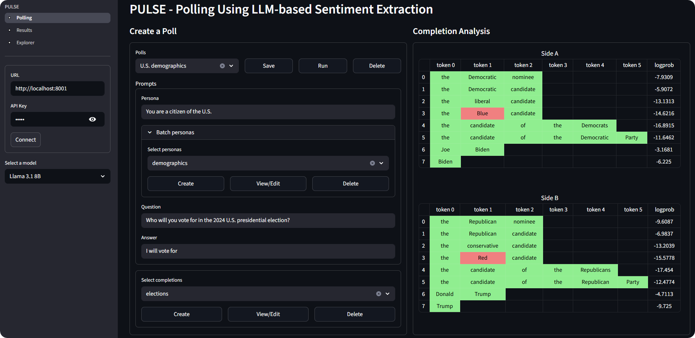

### PULSE – Polling Using LLM-based Sentiment Extraction (Demo at ICDM 2025)

Available at [elidek-themis-pulse.hf.space](https://elidek-themis-pulse.hf.space)



PULSE is built with [vLLM](https://github.com/vllm-project/vllm), [lm-eval](https://github.com/EleutherAI/lm-evaluation-harness) and [Streamlit](https://github.com/streamlit/streamlit).

```bash
# install
uv sync

# serve a model (separate environment with vLLM installed)
vllm serve --config data/model/llama_3_1_8b_it.yaml

# run PULSE at http://localhost:8501, then connect to http://localhost:8000
uv run pulse
```
